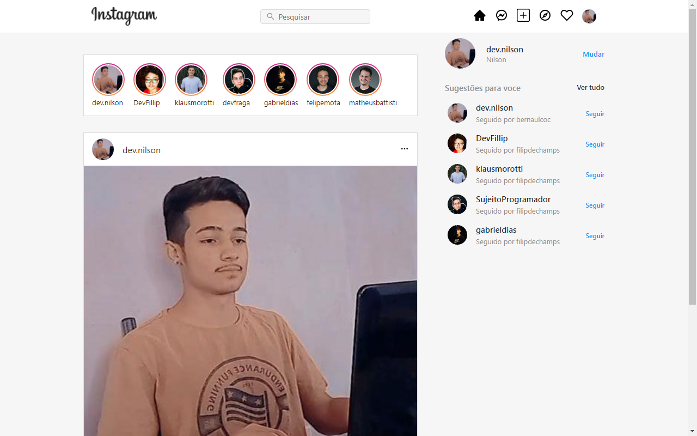
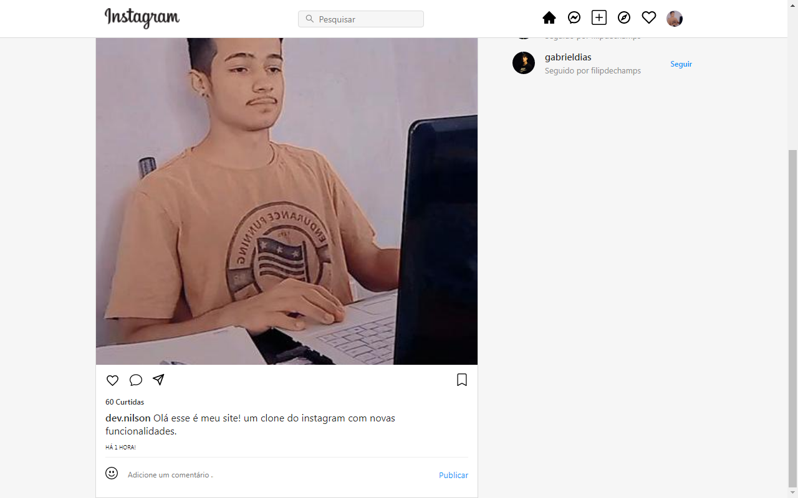

<h1 align='center'>Clone Instagram</h1>

 

 

<h2 align='center'>Descrição</h2> 

**Clone do Instagram** Projeto desenvolvido por mim usando a tecnologia **ReactJS** .

 

<h2 align='center'>Sobre</h2>

Clone com novas funcionalidades desenvolvidas por mim a fim de ganhar destaque, layout feito usando o **CSS grid** .
 
 

### **Tecnologias usadas** ->
 

- [ReactJS]()
- [CSS GRID]()
